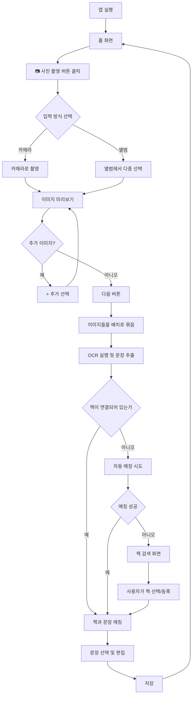
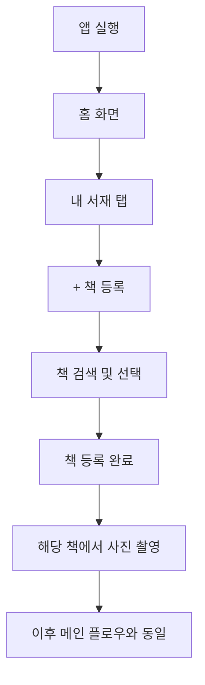

# Booked App - Product Requirements Document (PRD)

## 1. 프로젝트 개요

### 1.1 프로젝트명
Booked App

### 1.2 프로젝트 설명
**밑줄 친 문장을 중심으로 독서의 기록·맥락·기억을 자동으로 저장하고 확장하는 서비스**

사용자는:
- 책을 읽고 밑줄을 긋고
- 페이지를 사진(또는 스크린샷)으로 업로드하면
- 문장이 OCR로 추출되고
- 책이 자동 또는 검색 기반으로 매칭되며
- **문장 + 원본 이미지**가 함께 개인 노트로 저장된다.

> 이 앱은 문장을 기록하는 앱이 아니라, 문장을 중심으로 독서의 맥락·기억·공유를 확장하는 플랫폼이다.

### 1.3 목표 사용자
- 독서를 하며 인상 깊은 문장을 기록하고 싶은 사람
- 읽은 책의 문장을 체계적으로 관리하고 싶은 사람
- 다른 사람들과 좋은 문장을 공유하고 싶은 사람

### 1.4 핵심 가치 제안
- **간편한 입력**: 사진 한 장으로 문장 자동 추출
- **맥락 보존**: 문장 + 원본 이미지 + 페이지 번호 함께 저장
- **자동 매칭**: OCR 기반 책 자동 인식 및 검색
- **확장 가능**: 개인 기록 → 맥락 확장 → 소셜 확장

---

## 2. 핵심 설계 원칙

### 2.1 Dual Entry Model (양방향 진입)
- 📚 책을 먼저 등록해도 되고
- 📸 문장을 먼저 추출한 뒤 책을 검색·등록해도 됨
- 어떤 경로든 **동일한 결과 구조**로 수렴

### 2.2 Batch & Image-Linked Storage
- 여러 장 이미지를 **배치(batch)** 단위로 처리
- 저장되는 모든 문장은 **반드시 출처 이미지(upload)와 연결**

### 2.3 Future-Ready Architecture
- 개인 기록 → 맥락 확장 → 소셜 확장까지
- 데이터 구조와 흐름은 초기부터 확장 가능하게 설계

---

## 3. 기술 스택

| 카테고리 | 기술 |
|---------|------|
| Framework | React Native (Expo SDK 54) |
| Language | TypeScript (strict mode) |
| Navigation | Expo Router v6 |
| State Management | Zustand |
| UI Components | Custom + expo-blur, expo-linear-gradient |
| Backend | Supabase (PostgreSQL + Auth + Storage) |
| Local Database | expo-sqlite |
| OCR | Google Cloud Vision API |
| Book Search API | Naver Books API |
| Auth | Supabase Auth (이메일/소셜)

---

## 4. 기능 요구사항

### 4.1 MVP (Minimum Viable Product)

#### Phase 1: 핵심 기능 - 입력
| ID | 기능명 | 설명 | 우선순위 | 상태 |
|----|--------|------|----------|------|
| F-001 | 카메라 촬영 | 카메라로 책 페이지 직접 촬영 | P0 | 🔴 Not Started |
| F-002 | 앨범 다중 선택 | 갤러리에서 여러 이미지 선택 | P0 | 🔴 Not Started |
| F-003 | 배치 이미지 관리 | 여러 이미지를 하나의 세션으로 묶어 관리 | P0 | 🔴 Not Started |

#### Phase 1: 핵심 기능 - 처리
| ID | 기능명 | 설명 | 우선순위 | 상태 |
|----|--------|------|----------|------|
| F-004 | 배치 OCR | 여러 장 이미지 동시 OCR 처리 | P0 | 🔴 Not Started |
| F-005 | 문장 단위 분리 | OCR 결과를 문장 단위로 분리 | P0 | 🔴 Not Started |
| F-006 | 문장-이미지 연결 | 추출된 문장과 원본 이미지 연결 | P0 | 🔴 Not Started |

#### Phase 1: 핵심 기능 - 책 매칭
| ID | 기능명 | 설명 | 우선순위 | 상태 |
|----|--------|------|----------|------|
| F-007 | 기존 책 자동 매칭 | 등록된 책과 자동 매칭 시도 | P0 | 🔴 Not Started |
| F-008 | ISBN OCR | 이미지에서 ISBN 추출 | P0 | 🔴 Not Started |
| F-009 | 제목 OCR (fuzzy) | 이미지에서 책 제목 추출 및 퍼지 매칭 | P0 | 🔴 Not Started |
| F-010 | 책 검색 API | 매칭 실패 시 책 검색 API로 즉시 검색·등록 | P0 | 🔴 Not Started |

#### Phase 1: 핵심 기능 - 저장
| ID | 기능명 | 설명 | 우선순위 | 상태 |
|----|--------|------|----------|------|
| F-011 | 문장 단위 저장 | 문장 + 원본 이미지 + 페이지 번호 저장 | P0 | 🔴 Not Started |
| F-012 | 일괄 저장 | 여러 문장 동시 저장 | P0 | 🔴 Not Started |
| F-013 | 내 문장 목록 | 저장된 문장 조회 (랜덤/최근/책 기준) | P0 | 🔴 Not Started |

#### Phase 2: 확장 기능
| ID | 기능명 | 설명 | 우선순위 | 상태 |
|----|--------|------|----------|------|
| F-101 | 스크린샷 공유 (Share Extension) | 스크린샷에서 앱으로 바로 업로드 | P1 | 🔴 Not Started |
| F-102 | 책 구매 서점 등록 | 지도 기반 구매 서점 등록 | P1 | 🔴 Not Started |
| F-103 | 홈 위젯 | 랜덤 문장 위젯 노출 | P1 | 🔴 Not Started |

### 4.2 향후 기능 (Backlog)
| ID | 기능명 | 설명 | 우선순위 | 상태 |
|----|--------|------|----------|------|
| F-201 | 문장 공개/비공개 설정 | 개별 문장 공개 범위 설정 | P2 | 🔴 Not Started |
| F-202 | 다른 사람 문장 피드 | 공개된 문장 피드 탐색 | P2 | 🔴 Not Started |
| F-203 | 문장 좋아요/저장 | 다른 사람 문장 인터랙션 | P2 | 🔴 Not Started |

---

## 5. 비기능 요구사항

### 5.1 성능
- [ ] 앱 시작 시간: < 3초
- [ ] API 응답 시간: < 500ms
- [ ] OCR 처리 시간: < 5초/이미지
- [ ] 오프라인 지원 여부: TBD

### 5.2 보안
- [ ] 인증 방식: TBD
- [ ] 데이터 암호화: TBD
- [ ] 이미지 저장 보안: TBD

### 5.3 접근성
- [ ] WCAG 2.1 Level AA 준수

### 5.4 플랫폼 지원
- [ ] iOS (최소 버전: 15.0)
- [ ] Android (최소 버전: API 26)
- [ ] Web (선택)

---

## 6. 화면 설계

### 6.1 화면 목록
| 화면명 | 경로 | 설명 | 상태 |
|--------|------|------|------|
| 홈 | `/` | 내 문장 허브 + **사진 촬영 버튼 (Primary CTA)** | 🔴 Not Started |
| 카메라 | `/camera` | 책 페이지 촬영 (카메라 or 앨범 선택) | 🔴 Not Started |
| 이미지 미리보기 | `/preview` | 선택된 이미지 확인 및 추가 선택 | 🔴 Not Started |
| OCR 결과 | `/ocr-result` | 추출된 문장 확인 및 편집 | 🔴 Not Started |
| 책 검색 | `/book-search` | 책 검색 및 등록 | 🔴 Not Started |
| 책 상세 | `/book/[id]` | 책별 문장 목록 | 🔴 Not Started |
| 문장 상세 | `/note/[id]` | 문장 상세 + 원본 이미지 | 🔴 Not Started |
| 내 서재 | `/library` | 등록된 책 목록 | 🔴 Not Started |
| 설정 | `/settings` | 앱 설정 | 🔴 Not Started |

### 6.2 홈 화면 레이아웃
```
┌─────────────────────────────┐
│         내 문장 목록          │
│  ┌─────────────────────┐    │
│  │ 📖 책 제목           │    │
│  │ "문장 내용..."       │    │
│  └─────────────────────┘    │
│  ┌─────────────────────┐    │
│  │ 📖 책 제목           │    │
│  │ "문장 내용..."       │    │
│  └─────────────────────┘    │
│            ...              │
│                             │
│  ┌─────────────────────┐    │
│  │   📷 사진 촬영       │    │  ← Primary CTA (FAB)
│  └─────────────────────┘    │
└─────────────────────────────┘
```

### 6.3 사진 촬영 플로우
```
사진 촬영 버튼 클릭
        │
        ▼
┌───────────────────┐
│   선택 옵션       │
│ ┌───────────────┐ │
│ │ 📷 카메라 촬영 │ │
│ ├───────────────┤ │
│ │ 🖼️ 앨범에서   │ │
│ │    선택       │ │
│ └───────────────┘ │
└───────────────────┘
        │
        ├── 카메라 ──► 촬영 ──► 이미지 미리보기
        │
        └── 앨범 ──► 다중 선택 ──► 이미지 미리보기
                                        │
                                        ▼
                                  [+ 추가 선택]
                                  [다음 →]
                                        │
                                        ▼
                                   OCR 처리
```

### 6.4 네비게이션 구조
```
App
├── (tabs)
│   ├── index (홈 - 내 문장 + 사진 촬영 FAB)
│   ├── library (내 서재)
│   └── settings (설정)
├── camera (카메라 촬영 / 앨범 선택)
├── preview (이미지 미리보기)
├── ocr-result
├── book-search
├── book/[id]
└── note/[id]
```

---

## 7. 사용자 플로우

### 7.1 메인 플로우 (Quick Capture)



### 7.2 대체 플로우 (책 먼저 등록)



### 7.3 플로우 요약

| 단계 | 사용자 액션 | 시스템 반응 |
|------|------------|------------|
| 1 | 앱 실행 | 홈 화면 표시 (내 문장 목록) |
| 2 | 📷 버튼 탭 | 카메라/앨범 선택 옵션 표시 |
| 3 | 카메라 촬영 또는 앨범 선택 | 선택된 이미지 미리보기 |
| 4 | 추가 이미지 선택 (선택) | 미리보기에 추가 |
| 5 | 다음 버튼 탭 | OCR 처리 시작 |
| 6 | 문장 확인/편집 | 추출된 문장 표시 |
| 7 | 책 선택 (필요시) | 책 검색 화면 표시 |
| 8 | 저장 | 홈으로 복귀, 새 문장 표시 |

---

## 8. 데이터 모델

### 8.1 주요 엔티티
```typescript
// User - 사용자
interface User {
  id: string;
  email: string;
  name: string;
  created_at: Date;
}

// Book - 책
interface Book {
  id: string;
  user_id: string;
  title: string;
  author: string;
  isbn?: string;
  cover_image?: string;
  bookstore_id?: string;  // 확장: 구매 서점
  created_at: Date;
}

// UploadBatch - 업로드 배치 (독서 세션)
interface UploadBatch {
  id: string;
  user_id: string;
  book_id?: string;
  status: 'pending' | 'processing' | 'completed' | 'failed';
  created_at: Date;
}

// Upload - 원본 페이지 이미지
interface Upload {
  id: string;
  batch_id: string;
  image_url: string;
  source: 'camera' | 'gallery' | 'screenshot';
  page_number?: number;
  ocr_text?: string;
  created_at: Date;
}

// Note - 문장 (핵심 엔티티)
interface Note {
  id: string;
  user_id: string;
  book_id: string;
  upload_id: string;  // 원본 이미지와 연결
  content: string;    // 문장 내용
  page_number?: number;
  visibility: 'private' | 'public';  // 확장: 공개 범위
  created_at: Date;
}
```

### 8.2 엔티티 관계
```
User (1) ──< Book (N)
User (1) ──< UploadBatch (N)
Book (1) ──< Note (N)
UploadBatch (1) ──< Upload (N)
Upload (1) ──< Note (N)
```

---

## 9. API 명세

### 9.1 엔드포인트 목록
| Method | Endpoint | 설명 | 상태 |
|--------|----------|------|------|
| POST | `/api/auth/login` | 로그인 | 🔴 Not Started |
| POST | `/api/books` | 책 등록 | 🔴 Not Started |
| GET | `/api/books` | 내 책 목록 | 🔴 Not Started |
| GET | `/api/books/search` | 책 검색 (외부 API) | 🔴 Not Started |
| POST | `/api/batches` | 배치 생성 | 🔴 Not Started |
| POST | `/api/uploads` | 이미지 업로드 | 🔴 Not Started |
| POST | `/api/ocr` | OCR 처리 | 🔴 Not Started |
| POST | `/api/notes` | 문장 저장 | 🔴 Not Started |
| GET | `/api/notes` | 내 문장 목록 | 🔴 Not Started |
| GET | `/api/notes/random` | 랜덤 문장 | 🔴 Not Started |

---

## 10. 홈 화면 구조 (IA)

### 10.1 내 문장 공간 (Private) - MVP
- 내가 수집한 문장
- 정렬 옵션: 랜덤 / 최근 / 책 기준

### 10.2 다른 사람의 문장 공간 (Public) - After MVP
- 공개된 문장 피드
- 명확히 분리된 영역

---

## 11. 일정 및 마일스톤

### 11.1 마일스톤
| 마일스톤 | 목표 | 상태 |
|----------|------|------|
| M1: 환경 설정 | 개발 환경 구축 완료 | ✅ Done |
| M2: 기본 UI | 핵심 화면 레이아웃 | 🟡 In Progress |
| M3: 이미지 입력 | 카메라/갤러리 연동 | 🔴 Not Started |
| M4: OCR 연동 | OCR 처리 및 문장 추출 | 🔴 Not Started |
| M5: 책 매칭 | 책 검색 및 매칭 | 🔴 Not Started |
| M6: 저장 기능 | 문장 저장 및 조회 | 🔴 Not Started |
| M7: MVP 완성 | 전체 플로우 완성 | 🔴 Not Started |
| M8: 베타 | 테스트 및 피드백 | 🔴 Not Started |
| M9: 출시 | 앱스토어 배포 | 🔴 Not Started |

---

## 12. 리스크 및 제약사항

### 12.1 기술적 리스크
| 리스크 | 영향도 | 대응 방안 |
|--------|--------|----------|
| OCR 정확도 | 높음 | 여러 OCR 서비스 비교 테스트, 사용자 편집 기능 |
| 책 매칭 실패율 | 중간 | 수동 검색 UI 제공, 퍼지 매칭 알고리즘 개선 |
| 이미지 저장 비용 | 중간 | 이미지 압축, CDN 활용 |

### 12.2 제약사항
- Share Extension은 MVP 이후 구현 (iOS 네이티브 모듈 필요)
- 소셜 기능은 MVP 이후 구현

---

## 13. 확장 기능 방향 (Non-MVP)

1. 📲 **스크린샷 → 앱 바로 업로드** (Share Extension)
2. 📍 **책 구매 서점 지도 기반 등록**
3. 🏠 **홈 = 문장 허브** (내 문장 / 다른 사람 문장)
4. 🧩 **위젯으로 랜덤 문장 노출**

---

## 14. 변경 이력

| 날짜 | 버전 | 변경 내용 | 작성자 |
|------|------|----------|--------|
| 2025-12-21 | 0.1.0 | 초기 문서 생성 | |
| 2025-12-21 | 0.2.0 | 제품 정의 및 상세 기능 명세 추가 | |
| 2025-12-21 | 0.3.0 | Quick Capture 플로우 추가 (홈 → 사진 촬영 → OCR) | |
| 2025-12-21 | 0.4.0 | 기술 스택 확정 (Supabase, Google Vision, Naver Books) | |
| 2025-12-21 | 0.5.0 | Phase 1 구현 - 네비게이션, UI 컴포넌트, 스토어 | |

---

## 상태 범례
- 🔴 Not Started
- 🟡 In Progress
- 🟢 Done
- 🔵 Testing
- ⚫ Blocked
